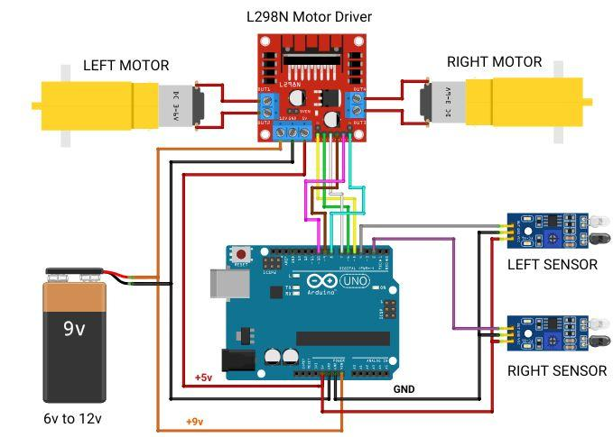

# line-following_robot
The line-following robot is a differential-drive mobile robot designed to autonomously follow a predefined black line on a white floor. The chassis consists of two independently driven rear wheels powered by DC motors and one free-rotating caster wheel mounted at the front to provide balance and support. Differential steering is achieved by varying the speeds of the two drive motors, allowing the robot to move forward and make left or right turns without a steering mechanism.

The robot employs two infrared (IR) reflective sensors mounted underneath the front of the chassis to detect the position of the black line. Each sensor emits infrared light toward the floor and measures the reflected light intensity. The white floor reflects more infrared light, whereas the black line absorbs most of it. By comparing the outputs of the left and right sensors, the robot determines whether it is centered on the line or has deviated to one side.

An Arduino microcontroller processes the sensor readings and generates the appropriate control signals for the motors. Motor actuation is performed through an L298N motor driver, which controls the direction and speed of the two DC motors using PWM signals from the Arduino. Based on the sensor inputs, the controller continuously adjusts the motor speeds to maintain alignment with the line.

## Electrical System

  

## Demonstration Video

  

